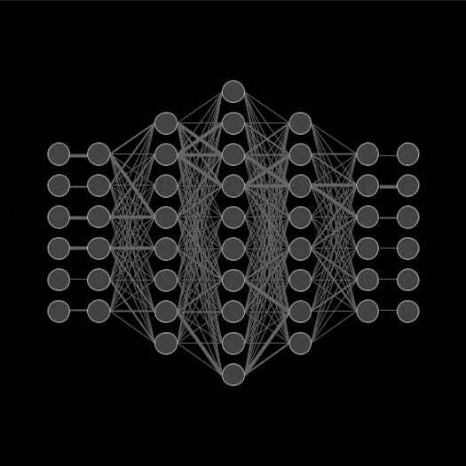

  

---

<table>
<tr>
<td>

  <b>👋 Hi, I'm Akshat Srivastava</b> 
  🎓 Electrical Engineering Graduate (Data Science Enthusiast) 
  📊 Aspiring <b>Data Analyst / Data Scientist</b> 
  💡 Passionate about <b>Data Visualization, Analytics, ML & Neural Networks</b>

</td>

<td>

</td>
</tr>
</table>
---

## 🚀 Connect With Me  

  
  &nbsp;&nbsp;
  

---

## 🛠️ Languages & Tools  

---

## 📂 Featured Projects  

| Project | Description | Tech Stack |
|---------|-------------|------------|
| [📊 Image Classification with CNN](https://github.com/AkshatStark06/Image_Classification_on_CIFAR-10) | CNN architecture, optimized using augmentation & regularization | Python, Keras, NumPy, Matplotlib |
| [🦠 Titanic Survival Data Analysis](https://github.com/AkshatStark06/Titanic-EDA) | Extracted insights, visualized survival trends | Python, Pandas, Matplotlib |
| [⚡ Smart traffic Light Control](https://github.com/AkshatStark06/Smart_Traffic_Light_Control_repo)) | Built smart traffic controller on STM32F405 | Emmbedded C, STM32 |
| [😃 Emotion Classification (LLaMA-3)](https://github.com/AkshatStark06/Emotion-Classification-Using-Llama-3)| Prompt-based emotion prediction | Python, HuggingFace, LLaMA-3 |
| [🛒 YouTube Video Summarization](https://github.com/AkshatStark06/Youtube-video-Summarization) | Extracted & summarized video transcripts | Python, BERT, HuggingFace |

---

## 📈 GitHub Stats & Streak  

  
  

  

---

## 🏆 GitHub Trophies  

  

---

## 👀 Visitor Count  

  

---

 
  <i>“Data is the new oil, but insights fuel progress.”</i>  

